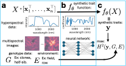

# H2Opt
H2Opt: A novel self-supervised algorithm to mine high-throughput phenotyping data for genetically-driven traits

<p align="center">
  
</p>

## Running H2Opt

### Requirements

The H2Opt software requires Python3 with the packages PyTorch and numpy. 

### Calculating ANOVA heritability 
Let n be the number of individuals. Define "traits" as an n by k PyTorch tensor of phenotypes. Define "groups" as a length n integer array representing genetically related groups such as clones. Define "environments" as an n by g matrix of categorical variables, where g is the number of environmental variables (and can be zero). Then, the heritability can be calculated as follows in Python. 

```python
from shared import ANOVAHeritability
H = ANOVAHeritability(traits, groups, envirements)
```
Specifically, if groups represent clones, this directly gives the broad-sense heritability. If groups have genetic relatedness Gamma, then narrow-sense heritability is H / Gamma. 
A full example of calculating the heritability of the first 10 wavelengths in our sorghum hyperspectral measurement dataset is given below.
```python
import numpy as np
import torch
from h2opt import loadnpz, ANOVAHeritability


X = np.concatenate((loadnpz('./data/examples/X_file1.npz'), loadnpz('./data/examples/X_file2.npz')), axis=0)
groups = loadnpz('./data/examples/genotypes.npz')
envirement = loadnpz('./data/examples/envirement.npz')
X_example = torch.tensor(X[:, :10]).float()

heritability = ANOVAHeritability(X_example, groups, envirement)
```
The output "heritability" is the tensor of the 10 heritability values tensor([0.0530, 0.0322, 0.0545, 0.0715, 0.0774, 0.0755, 0.0564, 0.0422, 0.0479, 0.0503]). 
As a minor aside, the measurement data X is split into two files due to GitHub file size limits. 

### Optimizing heritability 
Let n be the number of individuals. Define "groups" as a length n integer array representing genetically related groups such as clones. Define "environments" as an n by g matrix of categorical variables, where g is the number of environmental variables (and can be zero). Define "model" as the PyTorch model that determines the synthetic traits and will be trained. Define "X" as the HTP measurement data tensor (with the first axis having length n). Define "trainTest" as a numpy array of length n, with values 0 indicating individuals in the training set and values 1 indicating individuals in the test set. Define "modelFile" as the location for the trained model to be saved. The minimal usage of H2Opt heritability optimization is as below in Python. 
```python
from shared import trainModel
trainModel(model, X, groups, envirement, trainTest, modelFile)
```
Additional optional parameters include the following. ``Nphen`` is the number of phenotypes to extract, denoted by k in kH2Opt formulas. By default, Nphen = 1. "learningRate" is the Pytorch learning rate with a default of 1e-4. noiseLevel is data augmentation-based regularization level with a default value of 0.1. The below code sets these values. 
```python
from shared import trainModel
trainModel(model, X, groups, envirement, trainTest, modelFile, Nphen=Nphen, learningRate=learningRate, noiseLevel=noiseLevel)
```
Below is a full example of training a linear model to extract 10 synthetic traits on our sorghum hyperspectral measurement dataset. 
```python
import numpy as np
from h2opt import loadnpz, trainModel, multiConv, simpleModel

X = np.concatenate((loadnpz('./data/examples/X_file1.npz'), loadnpz('./data/examples/X_file2.npz')), axis=0)
groups = loadnpz('./data/examples/genotypes.npz')
envirement = loadnpz('./data/examples/envirement.npz')
trainTest = np.zeros(genotype.shape[0], dtype=int)

Nphen = 10
model = multiConv(Nphen, [X.shape[1], 1], simpleModel)

trainModel(model, X, groups, envirement, trainTest, './model.pt', Niter=10000, doPrint=True, Nphen=Nphen, learningRate=1e-5, noiseLevel=0.005)
```

This code results in the final model being trained and saved in ./model.pt. 


